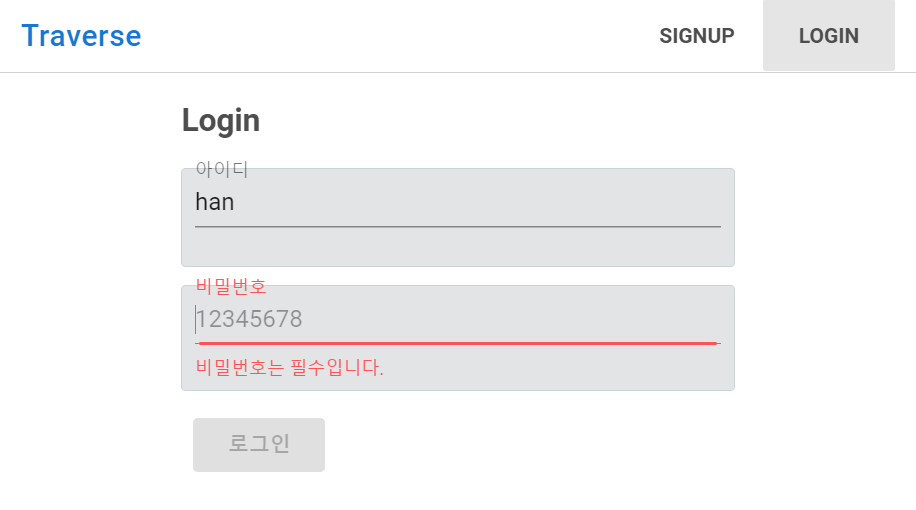
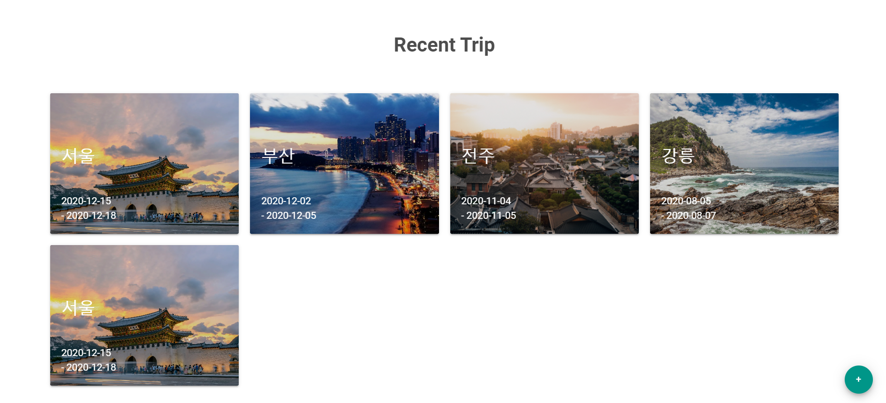
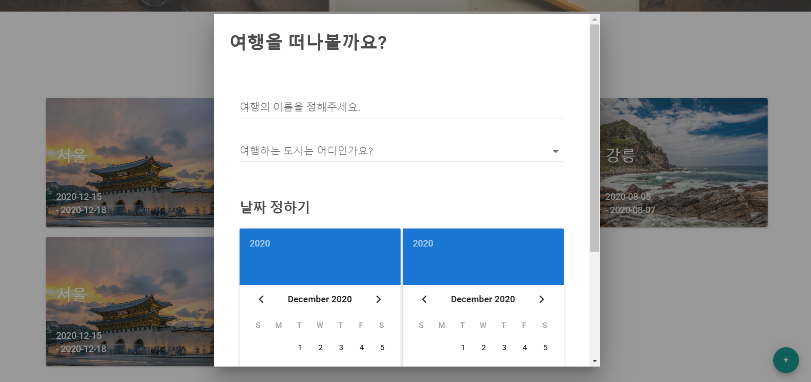
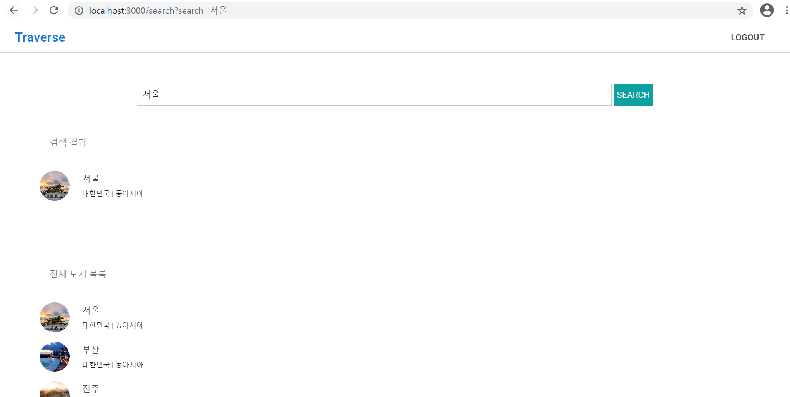
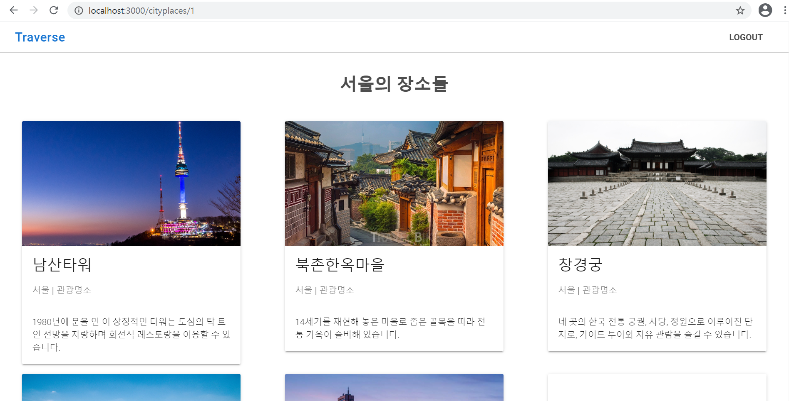
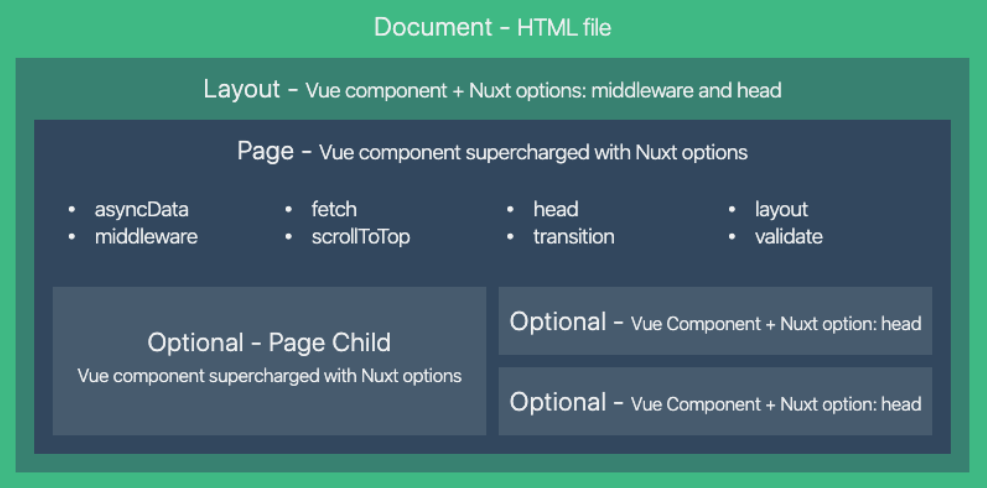
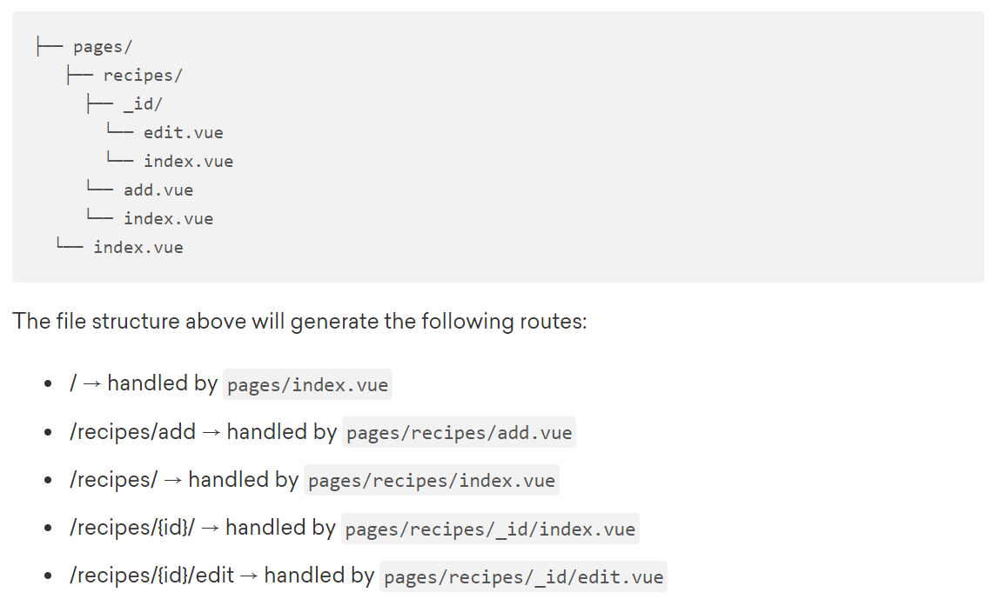

# 여행지 경로짜기

## 목차

- [개요](#개요)

- 기능

- 향후 전망

- nuxt개념

  

## 개요

#### 기간

2020.12.08 ~ 2020.12.16(?) 수정 가능


#### 목적

- 여러 여행지를 여행할 때, 지도상에서 경로를 확인하고 여행지 여행 순서 수정 가능하게 하는 반응형 웹 구현 

- nuxt.js 사용에 익숙해지고, 검색 최적화를 고려한 프로젝트 경험 쌓기


#### 유사 서비스

- 트리플


#### 역할 및 기여도

- 팀원: 혼자


#### 기술 스택

- 프론트: vue, vuex, nuxt, vuetify
- 백: django


## 기능

1. 로그인 & 회원가입 페이지

   - middleware 사용: 로그인 하지 않으면 다른페이지 접속 시 로그인 창으로 이동(검색 페이지 제외)

     ```javascript
     // middleware/authenticated.js
     export default function({ store, redirect }) {
         if (!store.state.users.token) {
             redirect('/login');
         }
     }
     
     // 다른 페이지들
     middleware: 'authenticated',
     ```




2. 메인페이지
   - 여행지 검색 기능
   - 사용자의 여행 목록
   - 새 여행 추가 기능





3. 여행 추가 모달 창




4. 여행 경로 페이지


5. 여행지 검색

   - 전체 도시 목록: asyncData로 ssr 도입

     ```javascript
     async asyncData({ $axios }) {
         try {
             let temp = await $axios.$get(`http://localhost:8000/api/cities`)
             let cityList = temp.results
             return { cityList }
         } catch (err) {
             return { cityList: [] }
         }
     },
     ```

     

   - 검색 결과: 검색에 따라 ajax 요청

     ```javascript
     onClickSearch() {
         const keyword = this.keyword.trim()
         if (keyword) {
             this.FETCH_CITYLIST({keyword: keyword})
             this.$router.push({ path: 'search', query: { search: keyword }})
         }
     },
     ```

     




6. 여행지 장소 목록 페이지

   - asyncData 사용

     ```javascript
     async asyncData({ $axios, params }) {
         try {
             let temp = await $axios.$get(`http://localhost:8000/api/places?city=${params.cityId}`)
             let placeList = temp.results
             return { placeList }
         } catch (err) {
             return { placeList: [] }
         }
     },
     ```

     

   - head 사용: 타이틀 수정

     ```javascript
     head() {
         return {
             title: this.placeList[0].city
         };
     },
     ```

     




## nuxt개념

1. 검색 최적화를 위하여 spa 개념에 ssr 개념을 도입

   - 특히 pages 디렉토리 내부의 컴포넌트에서는, 기존의 vue의 컴포넌트에 더해 여러가지 properties 제공

     

   - pages 내부 구조 설계

     


2. 생명주기
   - **middleware(클라이언트, 서버)** : 클라이언트와 서버 모두 훅들이 본격적으로 호출되기 전에, 앱을 만드는 과정에서 미리 정의해놓은 미들웨어들이 먼저 동작합니다. 만약 `serverMiddlware`을 정의했다면 서버 사이드에서만 렌더링 과정에서 일반 미들웨어가 동작하기 전에 먼저 동작합니다.
   - **asyncData(서버 or 클라이언트)**: 서버 혹은 클라이언트 사이드에서 생명주기 통틀어 한번씩만 호출되는 훅입니다. Vue 인스턴스의 생명주기 이전에 먼저 데이터를 가져와서 렌더링을 하고싶은 경우에 사용합니다. 컴포넌트를 로드하기 전에 항상 호출되며, 페이지 컴포넌트의 경우에만 사용할 수 있습니다. `asyncData` 의 리턴값은 Vue 인스턴스의 `data()`와 병합됩니다.
   - **beforeCreated, created(클라이언트, 서버)**: 서버에서 새로운 vue인스턴스를 생성한 뒤 이를 프리랜더링 하기 때문 Vue 인스턴스가 서버에서 만들어지는 시점에 `created`와 `beforeCreated`훅이 호출됩니다. 또한 클라이언트에서도 인스턴스를 만들고 `$mount` 메소드가 호출될 때도 따라 호출됩니다. 즉 서버와 클라이언트 사이드 양쪽에서 호출되는 훅입니다.
   - **beforeMount 이후의 훅(클라이언트)**: 클라이언트 사이드에서만, 하이드레이션 이후에 `$mount` 메소드가 호출될 때 나머지 Vue 생명주기 훅들이 실행됩니다.

